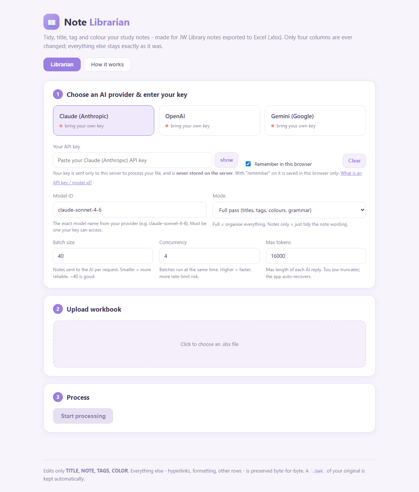

# Note Librarian

A small, friendly full-stack app that tidies your **JW Library** personal study notes. Export your notes to Excel (`.xlsx`), upload, and an AI model **you** choose — Claude, Gemini, or OpenAI — organises them with your own API key.



It classifies each note, gives it a searchable **title**, assigns a meaning-based **colour**, builds layered **tags**, and cleans up **note text** — while editing **only** those four columns and preserving the rest of the workbook (formatting, hyperlinks, every other cell) **byte-for-byte**.

---

## Why it's safe

- Edits are surgical: only the `TITLE`, `NOTE`, `TAGS`, and `COLOR` cells that actually change are rewritten, directly in the worksheet XML. Shared strings, styles, hyperlinks, and all other rows/sheets are left untouched.
- A `.bak` copy of your original file is created automatically on the first write.
- The behaviour is covered by tests (`tests/test_xlsx_io.py`).
- Your API keys live in `.env` and are never sent anywhere except the provider you pick.

---

## Quick start

> Requires **Python 3.10+**.

```bash
# 1. From the project folder, create a virtual environment
python -m venv .venv
# Windows:
.venv\Scripts\activate
# macOS/Linux:
source .venv/bin/activate

# 2. Install dependencies
pip install -r requirements.txt

# 3. Add your API key
copy .env.example .env        # Windows  (use: cp .env.example .env on macOS/Linux)
#   then edit .env and paste ONE key (ANTHROPIC_API_KEY / OPENAI_API_KEY / GEMINI_API_KEY)

# 4. Run
python run.py
```

Open **http://127.0.0.1:8000** in your browser.

---

## Two ways to provide an API key

1. **In the browser (bring-your-own-key)** — paste your key into the form. It is sent to the server only to run your file, is **never stored server-side**, and (optionally) remembered in *your* browser via `localStorage`. This is the mode to use if you **publish** the app for others — each person uses their own key.
2. **In `.env` (local single-user)** — set `ANTHROPIC_API_KEY` / `OPENAI_API_KEY` / `GEMINI_API_KEY` and the server uses it automatically; the form's key field can stay blank.

> **Publishing note:** if you host this for others, serve it over **HTTPS** so pasted keys are encrypted in transit, and keep your own keys out of `.env` on the shared server (let each user bring their own).

The app also has a built-in **"How it works"** tab explaining every field, the classification, the colour legend, and the safety model in plain language.

## How to use it

1. **Choose a provider** and enter your API key (or rely on `.env`). Pick a model (a sensible default is filled in) and a **mode**:
   - **Full pass** — classify + retitle + recolour + retag, plus light grammar fixes on short notes.
   - **Notes only** — leave titles/tags/colours alone and just clean the **note text**, at one of three levels (spelling only → grammar+clarity → clarity+reconstruct intent).
2. **Upload** your `.xlsx`. The app shows the detected sheet, row count, and which of the four target columns it found (matched by header name, so column order doesn't matter).
3. **Start processing.** Watch live progress, then review the **Review** list (notes flagged MEDIUM/LOW confidence) and **Pending tags** (suggested new tags — *not* applied automatically).
4. **Download** the processed workbook.

---

## The V8 rules (summary)

The full ruleset lives in [`backend/prompts.py`](backend/prompts.py) — edit it to tune behaviour. In short:

- **Never invent meaning.** Clarify only to preserve your intended meaning; preserve uncertainty words; keep your voice; British/Indian spelling.
- **Classify** each note (Note, Observation, Fact, Question, Reflection, Illustration, Outline, Research, Reference, Study-Note, Stub). Questions are kept unanswered; stubs/fragments are left as-is and flagged.
- **Title:** 20–70 chars, searchable, no scripture references.
- **Colour:** 1 Research · 2 Reflection · 3 Teaching point · 4 Observation (default) · 5 Warning · 6 Illustration.
- **Tags:** People → Topics → Situations → Workflow. Old tags are retired/remapped; genuinely new concepts are suggested as *pending* for your approval.
- **Low confidence → don't rewrite,** keep the original and add a `Review` tag.

---

## Configuration

All settings come from environment variables / `.env` (see `.env.example`):

| Variable | Purpose |
|---|---|
| `ANTHROPIC_API_KEY` / `OPENAI_API_KEY` / `GEMINI_API_KEY` | Provider keys (set the one you use) |
| `DEFAULT_PROVIDER` | Which provider is pre-selected |
| `DEFAULT_*_MODEL` | Default model per provider |
| `DEFAULT_BATCH_SIZE` | Notes per LLM request (smaller = more reliable JSON) |
| `DEFAULT_CONCURRENCY` | How many batches run at once |
| `DEFAULT_MAX_TOKENS` | Max output tokens per request |

Models change over time and depend on your account — set `model` in the UI (or the `DEFAULT_*_MODEL` envs) to one you have access to.

---

## Project layout

```
jwl-v8-librarian/
├── run.py                  # launcher (python run.py)
├── requirements.txt
├── .env.example            # copy to .env and add your key
├── backend/
│   ├── main.py             # FastAPI routes + serves the frontend
│   ├── config.py           # settings & provider key detection (.env)
│   ├── schemas.py          # request/response models
│   ├── xlsx_io.py          # surgical workbook reader/writer  ← safety core
│   ├── prompts.py          # System V8 prompts (editable)
│   ├── engine.py           # batching, concurrency, retry, applying edits, reports
│   ├── jobs.py             # in-memory job registry
│   └── providers/          # Claude / OpenAI / Gemini behind one interface
├── frontend/               # zero-build HTML + CSS + JS
└── tests/test_xlsx_io.py   # round-trip / byte-for-byte safety tests
```

## Running the tests

```bash
pytest -q
```

---

## Notes & limits

- Jobs are kept in memory, so a server restart clears job history (your downloaded files are unaffected). Fine for single-user local use.
- Very large batches can hit a model's output limit; if a batch's JSON can't be parsed, the engine automatically splits it and retries, and only ever leaves a note **unchanged** (never corrupts it) as a last resort — such rows appear under **Warnings**.
- Processed files and backups are written under `data/` (git-ignored).

---

## License

[MIT](LICENSE) © 2026 Leroy Dsouza
